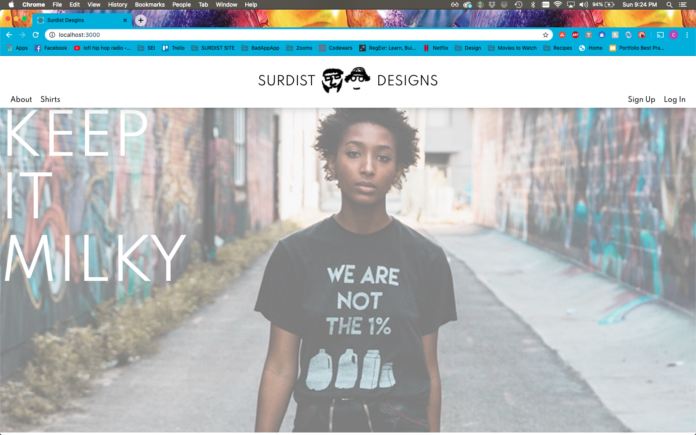
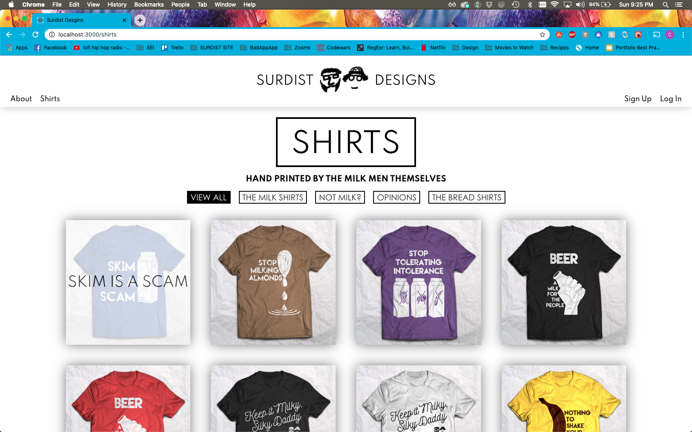
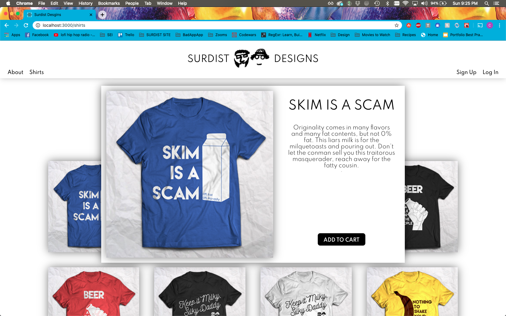
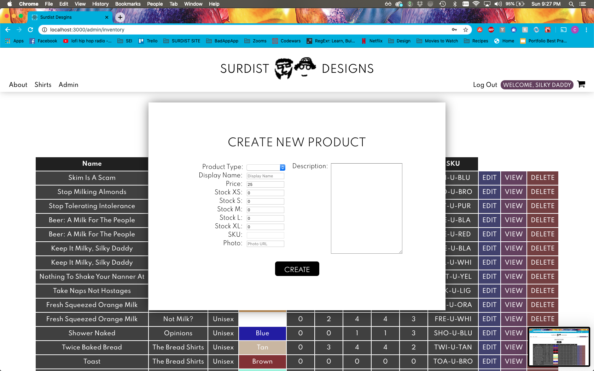
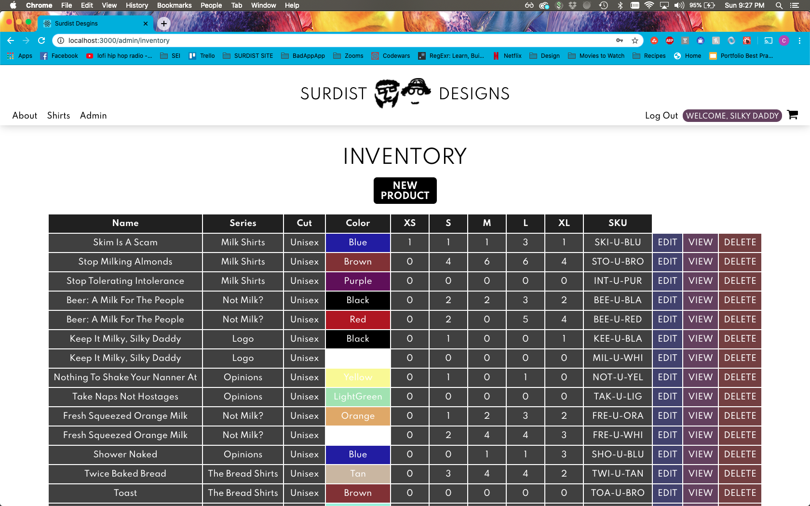

# SURDIST DESIGNS

Surdist Designs is an absurdist apparel company that specializes in pro whole milk propaganda and stupid opinions. Founded in 2018 by Cody Hart and Sam Stimson, it took off like a wildfire and instantly became an international sensation.

---

---

## TECHNOLOGIES USED
React, Express, NodeJS, HTML, CSS, Javascript, MongoDB, Mongoose, JWT, Adobe Photoshop

---
## GETTING STARTED

### PLANNING
[User Stories](https://trello.com/b/OFLgoY3S/surdist-website)

[Wireframes and ERD](https://www.lucidchart.com/documents/edit/1d17f09a-08ed-4e07-9205-05e00ed9172f?shared=true&)

---
[Check Out The App Here!](https://surdist.herokuapp.com/)

---
## NEXT STEPS
This website is still currently under construction. The next additions to be added are actually going through the ordering process. These will include creating a cart, placing an order, paying through the Stripe API, and more. Stay tuned...